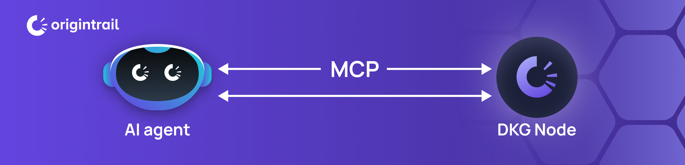

# The DKG Node + MCP

<figure><figcaption></figcaption></figure>

## Using MCP on DKG Node

The Model Context Protocol (MCP) is the bridge between your AI agents and the DKG Node. It allows applications, chatbots, or services to interact with the DKG in a standardized way — no custom glue code required.

With MCP, your node can:

* Publish knowledge as verifiable assets into the DKG.
* Query trusted knowledge with provenance, ready to ground AI outputs.
* Verify information, ensuring that what your AI consumes is authentic.

Think of MCP as the universal language your AI tools use to talk to the DKG Node. If your framework or agent speaks MCP (LangChain, VS Code, Cursor, Copilot Studio, etc.), it can immediately tap into the DKG without extra setup.

MCP makes your DKG Node usable by AI out of the box — transforming it from a passive node into an active gateway for verifiable, trusted knowledge.
